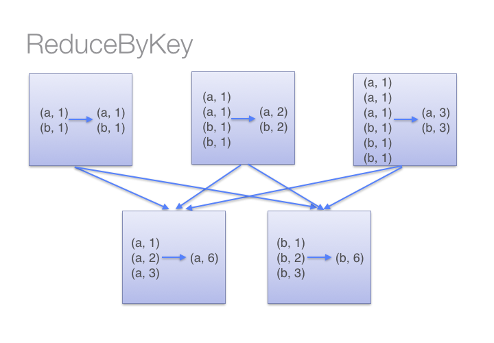
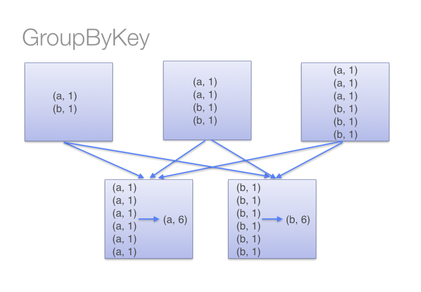

# Avoid GroupByKey

Let's look at two different ways to compute word counts, one using `reduceByKey` and the other using `groupByKey`:

```scala
val words = Array("one", "two", "two", "three", "three", "three")
val wordPairsRDD = sc.parallelize(words).map(word => (word, 1))

val wordCountsWithReduce = wordPairsRDD
  .reduceByKey(_ + _)
  .collect()

val wordCountsWithGroup = wordPairsRDD
  .groupByKey()
  .map(t => (t._1, t._2.sum))
  .collect()
```

While both of these functions will produce the correct answer, the `reduceByKey` example works much better on a large dataset.  That's because Spark knows it can combine output with a common key on each partition before shuffling the data.

Look at the diagram below to understand what happens with `reduceByKey`.  Notice how pairs on the same machine with the same key are combined (by using the lamdba function passed into `reduceByKey`) before the data is shuffled.  Then the lamdba function is called again to reduce all the values from each partition to produce one final result.




On the other hand, when calling `groupByKey` - all the key-value pairs are shuffled around.  This can result in an out of memory error.



You can imagine that for a much larger dataset size, the difference in the amount of data you are shuffling becomes more exaggerated and different between `reduceByKey` and `groupByKey`.

Here are more functions to prefer over `groupByKey`:

* `combineByKey` can be used when you are combining elements but your return type differs from your input value type.
* `foldByKey` merges the values for each key using an associative function and a neutral "zero value".


