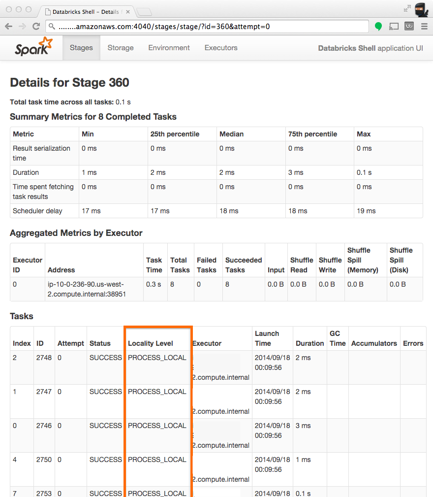

# Data Locality

Spark is a data parallel processing framework, which means it will execute tasks as close to where the data lives as possible.

## Checking Locality
The best means of checking whether a task ran locally is to inspect a given stage in the Spark UI. Notice from the screenshot below that the "Locality Level" column displays which locality a given task ran with.

## Adjusting Locality Confugrations
You can adjust how long Spark will wait before it times out on each of the phases of data locality (data local --> process local --> node local --> rack local --> Any). For more information on these parameters, see the `spark.locality.*` configs in the [Scheduling section of the Application Configration docs](http://spark.apache.org/docs/latest/configuration.html#scheduling).
