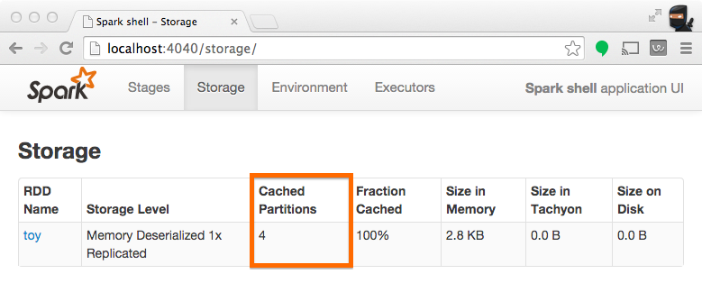

# How Many Partitions Does An RDD Have?

For tuning and troubleshooting, it's often necessary to know how many paritions an RDD represents. There are a few ways to find this information:

## Inspect RDD Partitions Programatically
In the Scala API, an RDD holds a reference to it's Array of partitions, which you can use to find out how many partitions there are:

```scala
scala> val someRDD = sc.parallelize(1 to 100, 30)
someRDD: org.apache.spark.rdd.RDD[Int] = ParallelCollectionRDD[0] at parallelize at <console>:12

scala> someRDD.partitions.size
res0: Int = 30
```

Note in the example above the number of partitions was intentionally set to 30 upon initialization.

## View Task Execution Against Partitions Using the UI
When a stage executes, you can see the number of partitions for a given stage in the Spark UI. For example, the following simple job creates an RDD of 100 elements across 4 partitions, then distributes a dummy map task before collecting the elements back to the driver program:

```scala
scala> val someRDD = sc.parallelize(1 to 100, 4)
someRDD: org.apache.spark.rdd.RDD[Int] = ParallelCollectionRDD[0] at parallelize at <console>:12

scala> someRDD.map(x => x).collect
res1: Array[Int] = Array(1, 2, 3, 4, 5, 6, 7, 8, 9, 10, 11, 12, 13, 14, 15, 16, 17, 18, 19, 20, 21, 22, 23, 24, 25, 26, 27, 28, 29, 30, 31, 32, 33, 34, 35, 36, 37, 38, 39, 40, 41, 42, 43, 44, 45, 46, 47, 48, 49, 50, 51, 52, 53, 54, 55, 56, 57, 58, 59, 60, 61, 62, 63, 64, 65, 66, 67, 68, 69, 70, 71, 72, 73, 74, 75, 76, 77, 78, 79, 80, 81, 82, 83, 84, 85, 86, 87, 88, 89, 90, 91, 92, 93, 94, 95, 96, 97, 98, 99, 100)
```

In Spark's application UI, you can see from the following screenshot that the "Total Tasks" represents the number of partitions:


## View Partition Caching Using the UI
When persisting (a.k.a. caching) RDDs, it's useful to understand how many partitions have made it in to the cache. The example below is identical to the prior example, except that we'll now cache the RDD prior to processing it. After this completes, we can use the UI to understand what has been stored from this operation.

```scala
scala> someRDD.setName("toy").cache
res2: someRDD.type = toy ParallelCollectionRDD[0] at parallelize at <console>:12

scala> someRDD.map(x => x).collect
res3: Array[Int] = Array(1, 2, 3, 4, 5, 6, 7, 8, 9, 10, 11, 12, 13, 14, 15, 16, 17, 18, 19, 20, 21, 22, 23, 24, 25, 26, 27, 28, 29, 30, 31, 32, 33, 34, 35, 36, 37, 38, 39, 40, 41, 42, 43, 44, 45, 46, 47, 48, 49, 50, 51, 52, 53, 54, 55, 56, 57, 58, 59, 60, 61, 62, 63, 64, 65, 66, 67, 68, 69, 70, 71, 72, 73, 74, 75, 76, 77, 78, 79, 80, 81, 82, 83, 84, 85, 86, 87, 88, 89, 90, 91, 92, 93, 94, 95, 96, 97, 98, 99, 100)
```

Note from the screenshot that there are four partitions cached.


